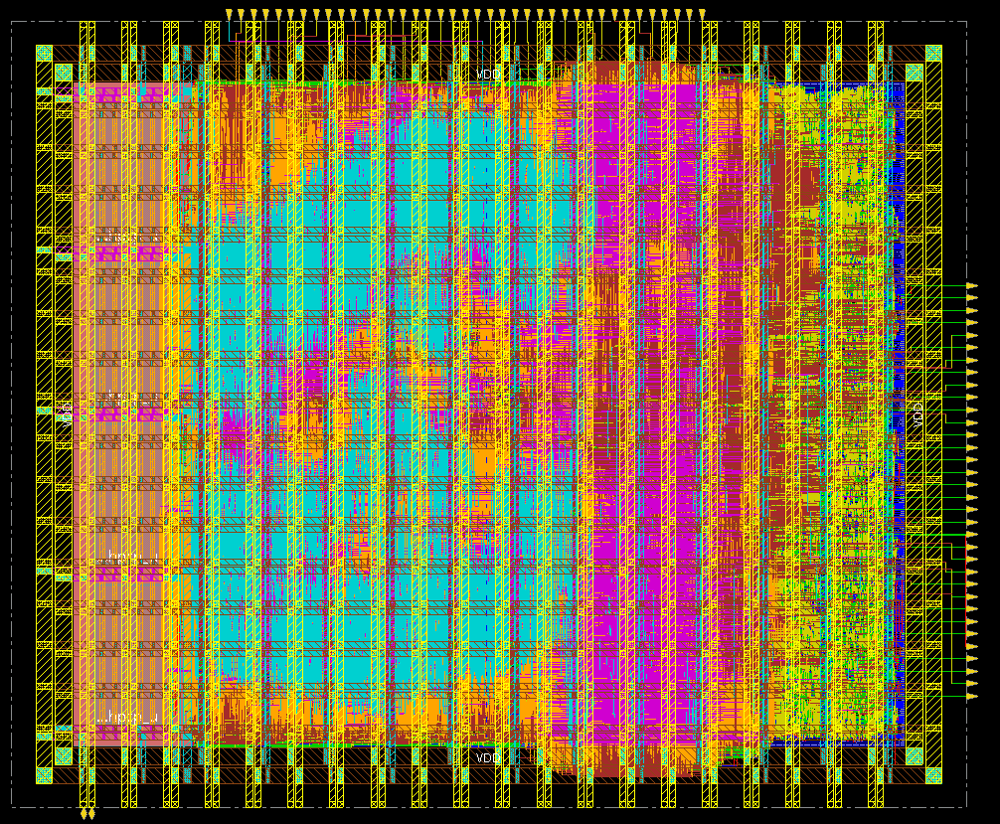

# multi-mode FFT processor

Author: BriMonzZY

</br>

*FOR STUDY ONLY*

*I cannot guarantee that this design is correct, it is for reference only!*

</br>

## Introduction

This repo is a configurable  **Simple R2MDC DIF-FFT Processor** implementation from algorithm to GDSII, supporting 64/128/256/512-point Fast Fourier Transform (FFT) and Inverse FFT (IFFT) computations. The design features a complete implementation flow including RTL verification and ASIC synthesis.

</br>


File hierarchy:

```txt
.
├── README.md
├── software # algorithm and data gen
├── rtl
|   ├── src # design files
|   └── sim
|       ├── tb_src # testbench files
|       ├── vcs # run VCS simulation
|       ├── xcelium # run xcelium simulation
|       └── verilator # TODO
├── syn # Synthesis
|   ├── syn_asic
|   |   └── scripts # ASIC synthesize scripts
|   └── syn_fpga # TODO
├── APR # Auto Placement & Router
|   └── innovus # run PnR flow with innovus
├── scripts # clean or backup scripts
└── (backup)

```

</br>

## Architecture

Radix-2 MDC DIF-FFT:


</br>

## Quick Start

Input and output ports of the FFT processor:

| **name**  | **in/out** | **width** | **description**                                              |
| --------- | ---------- | --------- | ------------------------------------------------------------ |
| clk       | I          | 1         | system clock                                                 |
| rst_n     | I          | 1         | System asynchronous reset, low level effective               |
| inv       | I          | 1         | Mode control, 0 represents FFT operation, 1 represents IFFT operation |
| np        | I          | 2         | FFT/IFFT points: 0 represents 64 points, 1 represents 128 points, 2 represents 256 points, and 3 represents 512 points |
| stb       | I          | 1         | Input data valid indication                                  |
| sop_in    | I          | 1         | The first valid data indicator for each set of input data (64 numbers) indicates that the high level is valid |
| x_re      | I          | 16        | Input data real part, binary complement fixed-point format   |
| x_im      | I          | 16        | Input data imaginary part, binary complement fixed-point format |
| valid_out | O          | 1         | Effective indication of output data                          |
| sop_out   | O          | 1         | The first valid data indicator for each set of output data (64 numbers) |
| y_re      | O          | 16        | Output data real part, binary complement fixed-point format  |
| y_im      | O          | 16        | Output data imaginary part, binary complement fixed-point format |

</br>

Edit `rtl/sim/test_vector/fft*_input_re.txt` to change the real part of FFT input data.

Edit `rtl/sim/test_vector/fft*_input_im.txt` to change the imag part of FFT input data.

Edit `rtl/sim/test_vector/ifft*_input_re.txt` to change the real part of IFFT input data.

Edit `rtl/sim/test_vector/ifft*_input_im.txt` to change the imag part of IFFT input data.

Edit the line (5 23 24 64 65) of file `rtl/sim/tb_src/fft_tb.v` to Change the input or the mode of processor.

The simulation output will generated in `fft_output_re.txt `and `fft_output_im.txt` , you can draw a waveform of the output by using `python software/wave.py`.

you can change the macro in file `fft_reoder_sramsp16x256_maskoff.v` to use Foundry SRAM or not.

</br>


### Simulation

run simulation with Synopsys VCS:
```bash
cd rtl/sim/vcs
# make help
make run
```

run simulation with Cadence XCELIUM:
```bash
cd rtl/sim/xcelium
# make help
make simx
```

debug with Synopsys Verdi:
```bash
cd rtl/sim/vcs
make debug
make rundebug
make wave # show waveform using verdi
```

</br>

### Synthesis

run synthesis with Design Compiler:

```bash
cd syn/syn_asic
# make help
make syn
```

</br>

### APR

run PnR with INNOVUS:

see `APR/innovus/README.md`.

</br>

## Result of simulation

Simulation waveform of 64-point FFT mode of our FFT processor:


</br>

</br>

### FFT

We use 0.005*sin(t) for real input ( Q15 format ) and imag input to calculate FFT output.

The following is the output of the FFT processor:

</br>

64-point FFT output:


The maximum error output from the Matlab fixed-point model is 13 ( Q15 format ).

</br>

128-point FFT output:


The maximum error output from the Matlab fixed-point model is 28 ( Q15 format ).

</br>

256-point FFT output:


The maximum error output from the Matlab fixed-point model is 61 ( Q15 format ).

</br>

512-point FFT output:


The maximum error output from the Matlab fixed-point model is 120 ( Q15 format ).

</br>

### iFFT

We use n, n-1,n-2,..., 0 as raw input to calculate FFT as input of iFFT.

The following is the output of the iFFT model of FFT processor:

</br>

64-point iFFT output:


The maximum error output from the Matlab fixed-point model is 1 ( Q15 format ).

</br>

128-point iFFT output:


The maximum error output from the Matlab fixed-point model is 1 ( Q15 format ).

</br>

256-point iFFT output:


The maximum error output from the Matlab fixed-point model is 1 ( Q15 format ).

</br>

512-point iFFT output


The output is **incorrect** due to the overflow of intermediate result bits within our current implementation.

</br>

## Result of Synthesis

The FFT processor can run at **701.7 MHz** at TSMC N28, since we haven't optimized timing yet.

</br>

setup timing report generated by Design Compiler:


</br>

## Result of PnR

</br>

We use TSMC N28 to impl this project

Die Area: 460.18x379.5 = 0.17463 mm^2

Layout of FFT processor:



</br>

## Future Work

1. Using a larger bit width for intermediate calculations to reduce accuracy loss.
1. Multi-parallel MDC architecture.
2. Optimize timing and SRAM load/stroe.
3. Use Foundry ROM.
3. Add ICC2 flow.
4. Add STA and signoff flow.

</br>

The design space for FFT hardware accelerators is still relatively large, and there are SDF MDF、SDC、MDC、SC、MSC、SFF、 There are even circuit architectures such as Radix-2 Combined SDC-SDF (R2CSS) and others; In terms of storage architecture, optimization can be achieved from aspects such as storage space and storage organizational structure There are also different combinations of Radix, choices of DIT and DIF, and so on. Different fields and applications require different characteristics and architectures. How FFT acceleration architecture performs Trade off is also a part that needs to be studied.

In short, the current FFT processor design cannot be considered a future work. The current work is only a reproduction of the basic circuit structure that is easy to understand.

